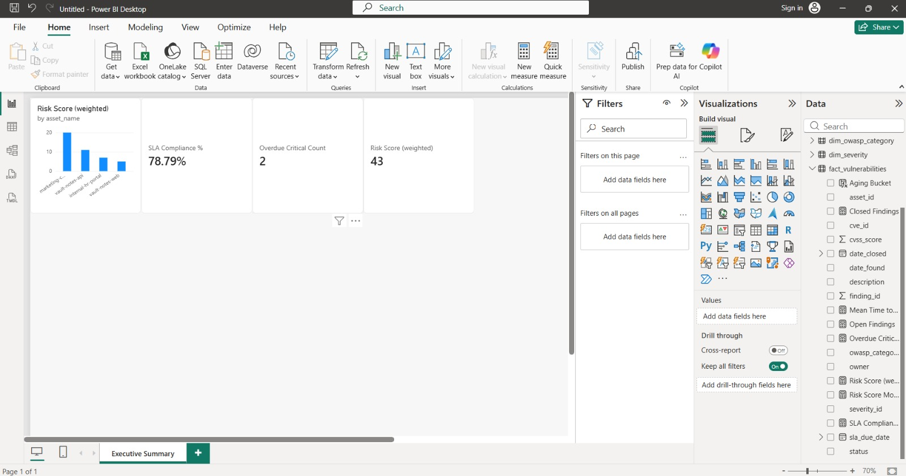
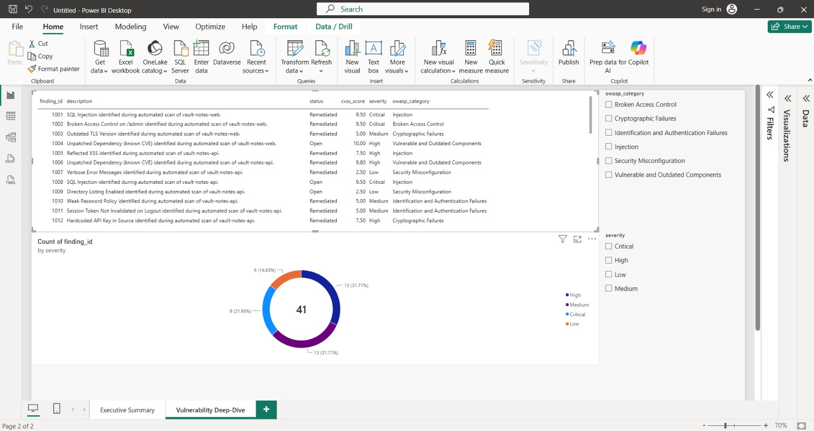
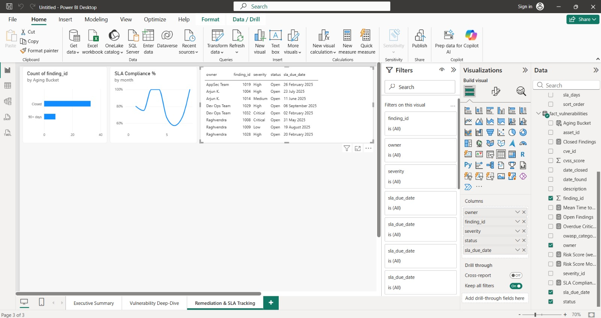
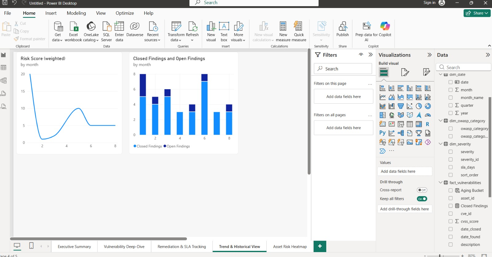
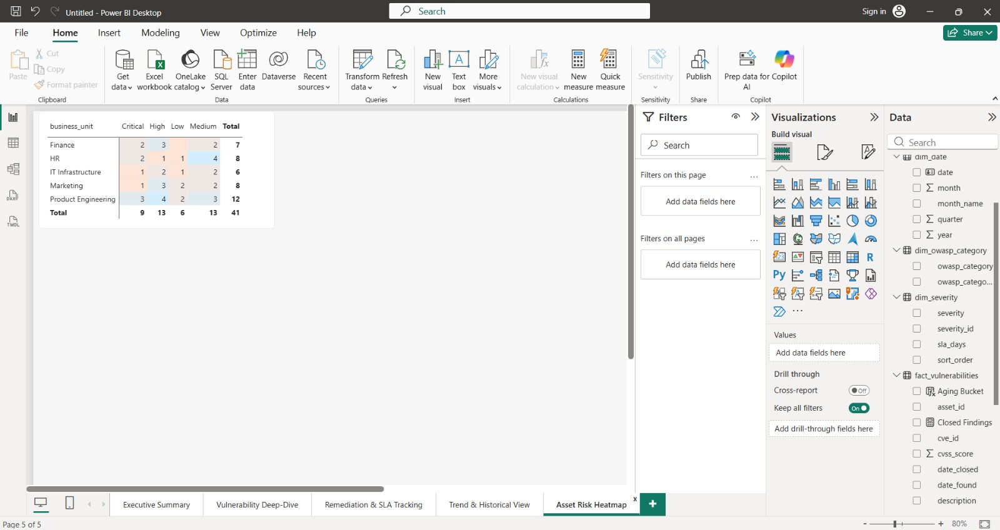

# CyberRisk Pulse

> **Status:** Complete — full pipeline built, 5-page Power BI dashboard live, all measures verified against real data.

A Power BI dashboard that turns vulnerability scan findings into the kind of risk report a security manager actually uses — what's overdue, what's riskiest, and whether the team is getting better or worse at fixing things.

Built on top of my own security tooling ([VulnScan](https://github.com/Raghavtripathii/vulnscan) and [Vault Notes](https://github.com/Raghavtripathii/vault-notes)), enriched with real CVE data from the public NVD database, and modeled as a proper star schema instead of one flat spreadsheet.

**Author:** Raghvendra Tripathi ([@Raghavtripathii](https://github.com/Raghavtripathii))

---

## Dashboard Preview

**Executive Summary** — risk score, SLA compliance, and overdue Critical count at a glance


**Vulnerability Deep-Dive** — filterable table and severity breakdown


**Remediation & SLA Tracking** — backlog aging and monthly SLA trend


**Trend & Historical View** — risk score and open/closed findings over time


**Asset Risk Heatmap** — findings by business unit and severity


---

## 1. What problem this solves (read this first)

Imagine you're the security manager at a company. Scans keep finding vulnerabilities. Tickets pile up. You have three questions and no easy way to answer any of them:

1. **What's actually urgent right now** — not just "Critical," but Critical *and* already past its deadline?
2. **Is my team keeping its promises?** We say we'll fix Critical issues in 7 days — are we actually doing that?
3. **Are things getting better?** Is our overall risk going up or down month over month?

This project builds the dashboard that answers all three.

---

## 2. How the whole thing fits together

```
Your VulnScan output ──┐
                        │
Real CVE data (NVD API) ─┼──► Python scripts ──► Clean tables (star schema) ──► Power BI Dashboard
                        │      (scripts/)          (data/*.csv + cyberrisk.db)
Remediation tracker ─────┘
(synthetic, documented)
```

In short: three small Python scripts create the raw data, one Python script cleans and joins it into a proper data model, and then Power BI just visualizes tables that are already clean. That order matters — a lot of beginner projects skip straight to Power Query and end up doing all their transformation logic inside the BI tool, which gets messy fast and is hard to explain in an interview.

---

## 3. Folder structure

```
cyberrisk-pulse/
├── README.md
├── requirements.txt
├── cyberrisk-pulse.pbix          <- the Power BI dashboard itself
├── screenshots/                  <- static images of all 5 pages
│   ├── 01-executive-summary.jpeg
│   ├── 02-vulnerability-deep-dive.jpeg
│   ├── 03-remediation-sla-tracking.jpeg
│   ├── 04-trend-historical-view.jpeg
│   └── 05-asset-risk-heatmap.jpeg
├── scripts/                      <- run these in order, 01 -> 04
│   ├── 01_generate_vulnscan_data.py
│   ├── 02_fetch_nvd_cve_data.py
│   ├── 03_generate_remediation_tracker.py
│   └── 04_etl_build_star_schema.py
├── sql/
│   └── schema.sql
├── dax/
│   └── measures.md
├── docs/
│   ├── data_dictionary.md
│   ├── design_decisions.md
│   └── executive_memo_template.md
└── data/                         <- generated CSVs + the SQLite DB land here (not committed to git)
```

---

## 4. Step-by-step: how to build this yourself

### Step 0 — set up

```bash
git clone https://github.com/Raghavtripathii/cyberrisk-pulse.git
cd cyberrisk-pulse
pip install -r requirements.txt
mkdir data
```

### Step 1 — generate the raw findings

```bash
python scripts/01_generate_vulnscan_data.py
```

This writes `data/raw_findings.csv`. If you already have a real export from your VulnScan tool, put it at that exact path instead and skip this script — the rest of the pipeline doesn't care where the file came from, only that it has the right columns (see the data dictionary).

### Step 2 — pull real CVE data

```bash
python scripts/02_fetch_nvd_cve_data.py
```

This hits the public NVD API and writes `data/cve_enrichment.csv`. It's a free public API with no key needed, but it asks you to go slow, so this script pauses a few seconds between requests — it'll take about 30 seconds to finish, that's expected.

*Note: if you're running this from a restricted network and the NVD API isn't reachable, that's fine — step 4 gracefully falls back to baseline severity scores instead.*

### Step 3 — build the remediation tracker

```bash
python scripts/03_generate_remediation_tracker.py
```

Writes `data/remediation_tracker.csv` — assigns an owner, a due date based on the SLA policy, and a status to every finding.

### Step 4 — run the ETL

```bash
python scripts/04_etl_build_star_schema.py
```

Joins all three sources together and writes out five clean tables — `fact_vulnerabilities`, `dim_asset`, `dim_severity`, `dim_owasp_category`, `dim_date` — both as CSVs and as a SQLite database (`data/cyberrisk.db`).

### Step 5 — bring it into Power BI Desktop

1. Open `cyberrisk-pulse.pbix` directly (fastest way to see the finished dashboard), or build it fresh: **Get Data → Text/CSV** → import all five CSVs from `data/`
2. In **Model view**, confirm relationships match `sql/schema.sql`
3. Mark `dim_date` as a **Date Table** to unlock time-intelligence DAX

### Step 6 — add the DAX measures

Every measure, explained in plain English before the formula, is in `dax/measures.md`.

### Step 7 — build the five report pages

1. **Executive Summary** — Risk Score card, SLA Compliance % card, Overdue Critical Count card, and a bar chart of riskiest assets
2. **Vulnerability Deep-Dive** — filterable findings table, severity donut chart, slicers for severity and OWASP category
3. **Remediation & SLA Tracking** — backlog aging chart, SLA compliance trend, table of overdue findings by owner
4. **Trend & Historical View** — risk score over time, findings opened vs. closed per month
5. **Asset Risk Heatmap** — business unit × severity matrix with conditional formatting

### Step 8 — write the executive memo

Already filled in at `docs/executive_memo_template.md` with the real findings from this build.

### Step 9 — publish

- Pushed to GitHub with clean, one-commit-per-file history
- The `.pbix` file and all 5 page screenshots are committed directly to this repo, so anyone can open the working dashboard or preview it without needing Power BI installed
- Linked alongside VulnScan and Vault Notes above so the whole story reads as one connected body of work

---

## 5. What this project demonstrates

- **SQL & Python ETL** — real joins, cleaning, and transformation logic
- **Proper data modeling** — a real star schema, not a flat table
- **DAX including time intelligence** — not just SUM() and COUNT()
- **A real external API integration** — live data from NVD, not just a downloaded Kaggle CSV
- **A custom-designed KPI** — the weighted Risk Score, with the reasoning behind it written down
- **Documentation** — data dictionary, design decisions, executive memo
- **Domain expertise** — tied directly into real security tooling I built myself, not a generic retail/HR dataset everyone else uses

---

## 6. Assumptions and known limitations (be upfront about these in interviews)

- SLA policy (7/30/90/180 days by severity) is a reasonable industry default, not a specific company's actual policy.
- Remediation tracking data (owners, statuses, close dates) is synthetically generated — the vulnerability findings and CVE data are real, the "who fixed it and when" layer is simulated because it would normally live in a ticketing system I don't have access to.
- The weighted Risk Score formula (10/5/2/1) is my own design choice, documented in `docs/design_decisions.md`.
- On the Trend & Historical View page, the month axis displays as numbers (1–12) rather than month names, due to a Power BI sort-order quirk with text-based month columns — a documented, low-priority cosmetic item that doesn't affect the underlying analysis.

---

## License

© 2026 Raghvendra Tripathi. This project is shared publicly as a personal portfolio piece. Feel free to reference the structure and approach for your own learning; please don't republish the code or dashboard as your own work.